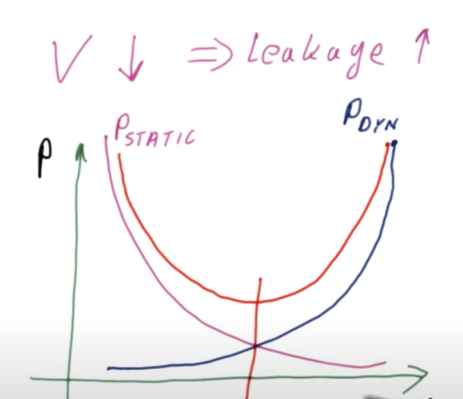

# Power Consumption

- Two types of power consumption:
  - <strong>Active Power</strong>: Power consumption when circuit is active.
  - <strong>Static Power</strong> (Leakage): Power consumption when circuit is idle.
- <strong>Active power = (1/2) . capacitance . (voltage^2) . frequency . activity factor</strong>
- The activity factor tells us the number of active active transistors per compute cycle and is dependant on chip architecture.
- For optimizing active power consumption we _really_ have to focus on bringing down voltage since its they are exponentially related.
- However, we can't lower the voltage too much since that would cause an increase in static power consumption due to leakage.
- Active power and static power are hence exponentially inversely propotional.
  

# Fabrication Cost

- Chips are manufactured using circular silicon disks called _wafers_.
- Due to the shape of these wafers and defects in the silicon itself as well as the manufacturing process, every bit of the wafer isn't converted into a chip which leads to wastage.
- We measure this wastage by calculating fabrication yield, which is the ratio of number of usable chips and total number of chips produced.
- The cost of a chip is hence proportional to its size but the relationship isn't linear.
- The cost of manufacturing a 100mm^2 is going to be more than 100 times the cost of manufacturing a 1mm^2 chip.
- Applying Moore's law to this concept, for every new generation of chips we have two routes for manufacturing chips:

  - **Making smaller and cheaper chips** that have the computational capacity of larger chips in the previous geneeration

    _Example : chips that had the computational capability of laptops in a previous generation can be made smaller and cheaper to be used in handheld devices like smartphones_.

  - **Making larger/better performing chips** while keeping the cost of manufacturing constant (as is the case for chips manufactured for high performance computing).
